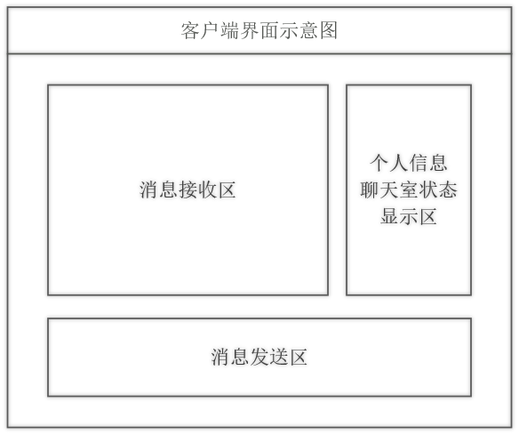

# 文件说明

* 文件创建时间：2020年04月08日
* 最后修改时间：2020年04月08日
* 文件主要内容：编写项目需求、可行性分析和技术分析

## 项目需求

* 基本功能
1. 使用Linux命名管道FIFO实现客户端服务器的通信
2. 某一客户端发送的消息，任何其他客户端都能接收到（群聊）
3. 客户端指定发送数据的对象（私聊）

* 进阶功能
1. 利用QT结合Linux编写图形界面 😛

2. 实现图形界面的登陆功能

## 可行性分析

> 写得这么low，这也能叫可行性分析？😂

* 对于最基本的功能

1. 使用Linux所学知识即可实现，完全可行
2. 以原有代码为基础，可以快速实现基本功能

* 对于进阶功能

1. 因为要使用到QT编程，还要将QT与Linux功能结合，对我来说是个挑战
2. 整个项目的持续时间挺长，接近两个星期，我觉得有必要挑战一下

## 技术分析

* 当前仅讨论`基本功能`的技术思路

1. 根据之前编写过的代码，目前已经实现了客户端和服务器之间的通信
2. 在之前的代码中，服务器不需要记录客户端的标识信息，只需向指定客户端定向发送数据即可。而本项目需要服务器把数据发送到所有的客户端，所以需要对已加入的客户端进行标识记录。
3. 每个客户端连接到服务器之后，都把自己的私有管道文件名记录到一个数组中。客户端向服务端发送数据后，服务器可以通过公有管道读到该客户端的数据。然后服务器通过遍历该数组，将读到的数据发给所有客户端，实现对所有客户端的数据发送，这样就能实现**群聊的效果**。
4. 第3步存在的问题是：向服务器发送数据的客户端，它本身不需要接收（或者说不需要显示）来自服务器的本条消息，因为本条消息就是该客户端自己发出的。 ~~所以服务器发数据的时候，需要跳过该客户端。~~ 初步想法是，在服务器发送数据的结构体中，加上一个标志(该客户端PID)。这样，客户端就可以无差别地接收服务器的数据，但是发送数据的客户端本身可以**收到数据但不显示**。
5. 另一个问题是，如何实现客户端之间的定向发送（**私聊的效果**）。目前的想法是：同样在客户端数据结构体中设置标志位，服务器收到客户端的数据之后，判断该标志位的值。默认情况下是向所有客户端循环遍历发送数据，当存在标志位时，只定向给目标客户端发送数据。这样可以节省数据发送时间。
6. 整体上感觉`基本功能`的逻辑算法还是比较清晰、简单的，只不过就是代码量可能会比较多。。。
