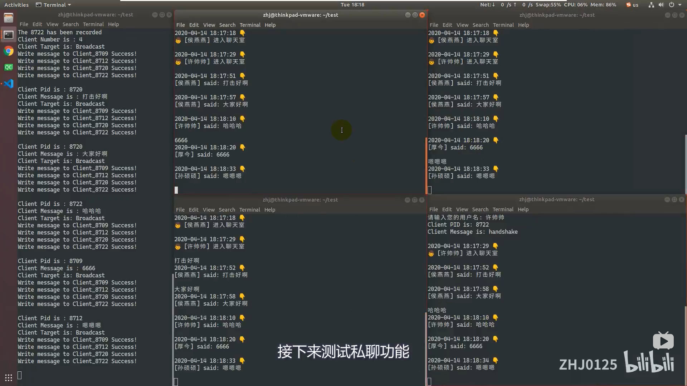

# 操作说明

> 本章节用来描述程序的运行方法

## 1. 编译程序

* 进入到`/Project`目录下
* 使用`make`命令，对程序进行编译
* 编译完成后，会生成客户端程序`client`和服务端程序`server`

## 2. 运行服务器程序

* 承接上一步
* 执行`./server`，以启动服务端程序
* 等待客户端的信息

## 3. 运行客户端程序

* 承接上一步
* 打开一个新的终端
* 在新终端中执行`./client`，以启动客户端程序
* 根据提示，输入您的用户名
* 在终端中直接输入您要发送的信息，信息将会以广播的形式，发给所有在线的客户端
* 使用`to: [Target_Client_Name] [Message_To_Be_Sent]`的格式，可以向指定的客户端发送私聊信息
* 可以开启多个终端，启动多个客户端程序进行测试
* 在终端输入`quit`可以退出程序

## 4. 测试视频

> 建议您观看该测试视频，以便更好地了解测试方法

* 点击观看 [BiliBili - Linux_命名管道_聊天室_V2.0版本_测试视频](https://www.bilibili.com/video/BV1254y197AU/)

---
> 目前已录制了两支视频，分别是`Linux_命名管道_聊天室_测试视频`和`Linux_命名管道_聊天室_测试视频_V2.0`

* 点击观看 **[BiliBili - Linux_命名管道_聊天室_测试视频_V2.0版本](https://www.bilibili.com/video/BV1254y197AU/)**
   * 修复了V1.0版本退出程序的bug
   * 实现了在某个客户端退出后，服务器向其他用户发送通知的功能
   * 优化了客户端界面

* 点击观看 **[BiliBili - Linux_命名管道_聊天室_测试视频_V1.0版本](https://www.bilibili.com/video/BV1Pi4y187co/)**
   * 实现了群聊功能
   * 实现了以用户名为标识的私聊功能
---
