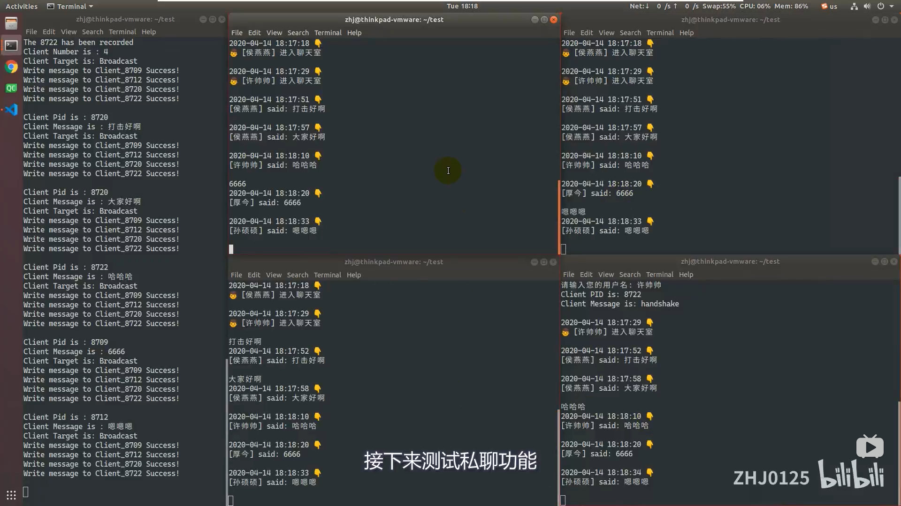

# 操作说明

> 本章节用来描述程序的运行方法

## 0. 克隆工程文件

* 为了保证工程文件的完整性，请使用git克隆本工程
```bash
# Example
zhj@thinkpad-vmware:~$ git clone https://gitee.com/zhj0125/FIFO_ChatRoom.git
Cloning into 'FIFO_ChatRoom'...
remote: Enumerating objects: 258, done.
remote: Total 258 (delta 0), reused 0 (delta 0), pack-reused 258
Receiving objects: 100% (258/258), 10.87 MiB | 1.23 MiB/s, done.
Resolving deltas: 100% (104/104), done.
zhj@thinkpad-vmware:~$ 
```

## 1. 编译程序

* 进入到`/Project`目录下
* 使用`make`命令，对程序进行编译
* 编译完成后，会生成客户端程序`client`和服务端程序`server`
```bash
# Example
zhj@thinkpad-vmware:~$ ls
Desktop    Downloads  Music  Public  Pictures   Videos
Templates  Documents  FIFO_ChatRoom  TicketingSystem
# 进入FIFO_ChatRoom工程文件夹
zhj@thinkpad-vmware:~$ cd FIFO_ChatRoom/
zhj@thinkpad-vmware:~/FIFO_ChatRoom$ ls
Data  LICENSE  MkDocs  Project  README.md
zhj@thinkpad-vmware:~/FIFO_ChatRoom$ cd Project/
zhj@thinkpad-vmware:~/FIFO_ChatRoom/Project$ ls
client.c  fifo.c  fifo.h  Makefile  server.c
# 编译
zhj@thinkpad-vmware:~/FIFO_ChatRoom/Project$ make
cc    -c -o client.o client.c
cc    -c -o fifo.o fifo.c
cc    -c -o server.o server.c
rm ./*.o
# 检查生成的文件
zhj@thinkpad-vmware:~/FIFO_ChatRoom/Project$ ls
client  client.c  fifo.c  fifo.h  Makefile  server  server.c
zhj@thinkpad-vmware:~/FIFO_ChatRoom/Project$ 
```

## 2. 运行服务器程序

* 承接上一步
* 执行`./server`，以启动服务端程序
* 等待客户端的信息
```bash
# Example
zhj@thinkpad-vmware:~/FIFO_ChatRoom/Project$ ./server 
Server_FIFO has been bulid
■  # 光标在此处闪烁，服务端阻塞
```

## 3. 运行客户端程序

* 承接上一步
* 打开一个新的终端
* 在新终端中执行`./client`，以启动客户端程序
* 根据提示，输入您的用户名
* 在终端中直接输入您要发送的信息，信息将会以广播的形式，发给所有在线的客户端
* 使用`to: [Target_Client_Name] [Message_To_Be_Sent]`的格式，可以向指定的客户端发送私聊信息
* 可以开启多个终端，启动多个客户端程序进行测试
```bash
# Example
-------------------------------------------------------
# 在新的终端窗口执行以下命令
zhj@thinkpad-vmware:~$ cd FIFO_ChatRoom/Project/
zhj@thinkpad-vmware:~/FIFO_ChatRoom/Project$ ./client 
🎉 欢迎来到FIFO聊天室 🎉
请输入您的用户名: ZHJ0125
Client PID is: 5496
Client Message is: handshake
2021-11-12 14:48:10 👇
👦 [ZHJ0125] 进入聊天室 
hello,this is zhj!       # 用户在此处输入聊天信息
2021-11-12 14:54:39 👇
[ZHJ0125] said: hello,this is zhj!
■ # 客户端阻塞，等待用户输入聊天信息
-------------------------------------------------------
# 在服务端终端窗口显示以下信息
zhj@thinkpad-vmware:~/FIFO_ChatRoom/Project$ ./server 
Server_FIFO has been bulid
Client Pid is : 5496             # 客户端进程号
Client Message is : handshake
This is a new client!
Client_FIFO_5496 has been bulid  # 根据客户端进程号创建管道文件
The 5496 has been recorded
Client Number is : 1
Client Target is: Broadcast
Write message to Client_5496 Success!
# 服务端显示一组广播消息
Client Pid is : 5496             # 源客户端的进程号
Client Message is : hello,this is zhj! # 源客户端消息内容
Client Target is: Broadcast      # 消息类型，此处为广播消息，所有客户端均可接收
Write message to Client_5496 Success!
■ # 光标在此处闪烁，服务端阻塞，等待客户端下次发送消息
-------------------------------------------------------
```

## 4. 退出程序

* 客户端输入 `quit` 退出聊天室
* 服务端使用 `Ctrl + C` 组合键退出程序
```bash
# 客户端执行命令
quit      # 输入quit
Client_5496 exit
Removed Client_FIFO_5496
Child process has been stoped
zhj@thinkpad-vmware:~/FIFO_ChatRoom/Project$ 
# 服务端执行退出命令
^C        # 组合键Ctrl+C
Server is exiting...
Removed Server_FIFO
See you again 😉
zhj@thinkpad-vmware:~/FIFO_ChatRoom/Project$ 
```

## 5. 测试视频

> 建议您观看该测试视频，以便更好地了解测试方法

* 点击观看 [BiliBili - Linux_命名管道_聊天室_V2.0版本_测试视频](https://www.bilibili.com/video/BV1254y197AU/)

[](https://www.bilibili.com/video/BV1254y197AU/)

---

> 目前已录制了两支视频，分别是`Linux_命名管道_聊天室_测试视频`和`Linux_命名管道_聊天室_测试视频_V2.0`

* 点击观看 **[BiliBili - Linux_命名管道_聊天室_测试视频_V2.0版本](https://www.bilibili.com/video/BV1254y197AU/)**
   * 修复了V1.0版本退出程序的bug
   * 实现了在某个客户端退出后，服务器向其他用户发送通知的功能
   * 优化了客户端界面

---

* 点击观看 **[BiliBili - Linux_命名管道_聊天室_测试视频_V1.0版本](https://www.bilibili.com/video/BV1Pi4y187co/)**
   * 实现了群聊功能
   * 实现了以用户名为标识的私聊功能
---
